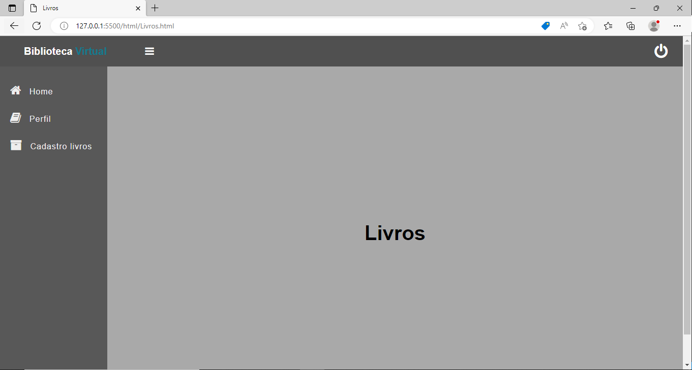

# Registro de Testes de Software

### Caso de teste - 01

Verificar se o sistema apresenta corretamente a lista com todos os livros disponíveis na biblioteca, incluindo o título e autor.

A lista de livros disponiveis estarão nessa tela.

#### Caso de teste - 02

O sistema deve permitir que qualquer usuário visualize todas as informações de status do livro para reservas

Nessa tela o usuário podera cadastrar e consultar as informções de determinado livro. 

## Avaliação

Diante de um cenário onde o projeto em questão atualmete se encontra estático e limitado a tecnologias front-end, os testes realizados foram concluidos parcialmete. O projeto necessitará de uma base de dados para que os testes sejam bem sucedidos.  